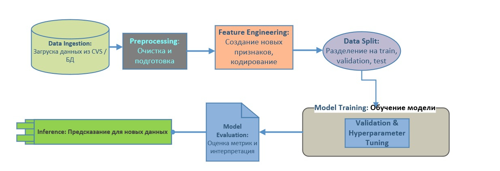

### Диаграммы потоков данных/пайплайнов, ключевые решения

# Архитектура проекта

## 1. Общая схема пайплайна



## 2. Компоненты пайплайна

### Data Ingestion (Загрузка данных)
- Источники: CSV файлы из Kaggle, CSV или базовые таблицы из внутреннего хранилища.
- Используются библиотеки: `pandas` и `SQLAlchemy`.
- Задача: импортировать исходные данные, проверить целостность и типы.

### Preprocessing (Обработка)
- Очистка данных: обработка пропусков (замена медианой или модой).
- Кодирование категориальных признаков: One-Hot Encoding с использованием `scikit-learn` или `pandas`.
- Масштабирование числовых признаков: `StandardScaler` или `MinMaxScaler`.
- Обработка выбросов и редких категорий.

### Feature Engineering (Создание признаков)
- Использование дат: извлечение признаков из дат (месяц, день недели, длина подписки).
- Бинаризация: создание флагов для категорий с высокой кардинальностью.
- Взаимосвязи и агрегированные признаки.

### Model Training (Обучение модели)
- Используются алгоритмы: `scikit-learn` — логистическая регрессия, дерево решений; `lightgbm` или `catboost` для мощных градиентных бустингов.
- Метод оценки: стратифицированная 5-кратная кросс-валидация.
- Гиперпараметризация через `Optuna` или `GridSearchCV`.

### Validation & Evaluation (Валидация и оценка)
- Метрики: ROC-AUC, PR-AUC, F1-score, матрицы ошибок.
- Внутреннее калибровка вероятностей: `scikit-learn` — `CalibratedClassifierCV`.
- Интерпретация: SHAP или `feature_importance`.

### Inference / Serving (Деплой и предсказания)
- Использование обученной модели из `models/`.
- Веб-сервис или автоматический скрипт для получения предсказаний для новых данных.

## 3. Ключевые архитектурные решения

- **Выбор алгоритмов:** LightGBM и CatBoost за быструю работу с категориальными признаками и хорошую точность.
- **Обработка категориальных признаков:** встроенные механизмы CatBoost или One-Hot Encoding.
- **Валидация:** стратифицированная кросс-валидация для сохранения пропорций класса.
- **Воспроизводимость:** зафиксированные сиды (random_state=42), версии пакетов.
- **Обработка дисбаланса:** использование метрик с учетом дисбаланса, а также возможной взвешенной выборки.

## 4. Структура репозитория
```
/project
├── data/
│   ├── processed/  # Обработанные данные
│   └── raw_data/   # Исходные данные
├── docs/           # Документация
│   └── images/     # Изображения для документации
├── models /        # Модели
├── notebooks/      # Jupyter-ноутбуки и .py-файлы с кодом 
│   ├── encoders/   # Содержит словарь расшифровки данных
│   └── pckgs/      # Самописные функции
├── plots /         # графики
├── tests /         # Тесты
├── requirements.txt
└── README.md
```

## 5. Инструменты и версионирование

• MLflow: управление экспериментами, автоматизация логирования метрик, версионирование моделей.
• DVC: контроль версий данных и артефактов данных.
• Git: контроль версий кода.
• Пакеты: `scikit-learn`, `lightgbm`, `catboost`, `pandas`, `numpy`.
