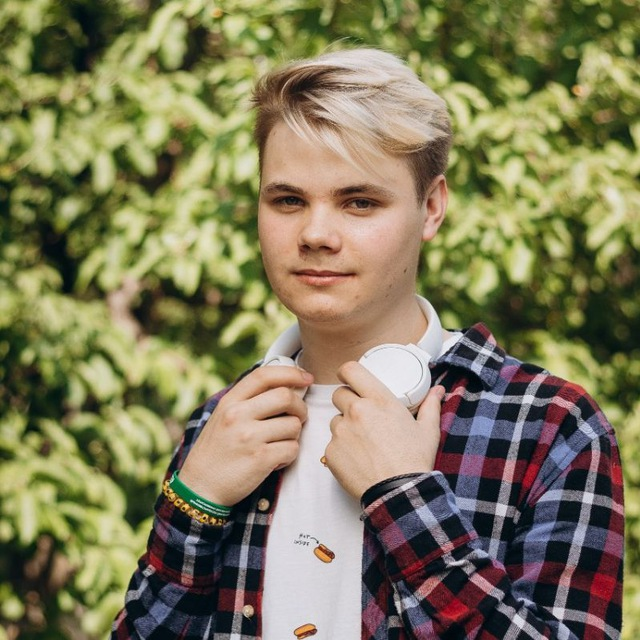

---
## Команда проекта и распределение ролей
---

# Менеджер проекта

## Окольнов Виктор Евгеньевич

Краткая биография:  
Виктор Евгеньевич — опытный руководитель проектов в области Data Science и машинного обучения с более чем 6-летним стажем. Обладает навыками организации команд, планирования и обеспечения выполнения сроков. Имеет опыт работы в сфере аналитики и разработки решений по предсказанию и моделированию. Его обязанности включают управление задачами, контроль прогресса, коммуникацию с командой и документацию.

Обязанности в проекте:  
• Организация и контроль выполнения задач  
• Планирование этапов спринта и распределение ролей  
• Отслеживание рисков и управление коммуникациями  
• Обеспечение актуальности документации (/docs) и отчётности

---

# Разработчик / Тестировщик

## Коткин Виталий Сергеевич

Краткая биография:  
Виталий Сергеевич — специалист по машинному обучению и тестированию с более чем 4-летним опытом. Занимается подготовкой данных, построением моделей, их интерпретацией и автоматизацией тестирования ML-систем. Обладает навыками работы с данными, анализом дисбаланса, калибровкой моделей и написанием тестов для обеспечения качества системы.

Обязанности в проекте:  
• Импорт данных из Kaggle и первоначальный анализ  
• Анализ и визуализация данных, оценка дисбаланса  
• Кодирование категориальных переменных, нормализация признаков  
• Построение и настройка моделей (majority class, логистическая регрессия, RandomForest, Gradient Boosting)  
• Реализация экспериментов, интерпретация моделей (SHAP/importance)  
• Валидация: настройка K-fold, калибровка, сравнение метрик  
• Тестирование: юнит-тесты, интеграционные и end-to-end тесты  
• Ведение документации по тестам (TESTING.md) и подготовка материалов к презентации
